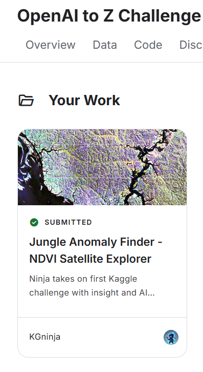
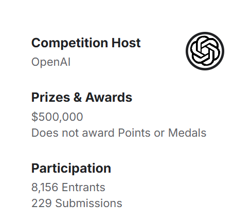

# KGchallengedskill

## OpenAI to Z Challenge — Jungle Anomaly Finder (NDVI Satellite Explorer)

**Role:** Independent Researcher / Builder  
https://www.kaggle.com/kgninja

**Timeline:** 2025  
**Format:** Selective, hackathon-style write-up track

# 📜 Resume Entry — Kaggle x OpenAI Hackathon

## OpenAI to Z Challenge (Kaggle × OpenAI, 2025)

- Participated in a **rare hackathon-style Kaggle competition** hosted by OpenAI.  
- **Format uniqueness**:  
  - Only **one submission per team allowed** (no retries).  
  - **English write-up required** with reproducibility and multi-source validation.  
  - Unlike typical Kaggle challenges, no official dataset was provided; participants had to gather and analyze open data independently.  
- **Scale and selectivity**:  
  - **8,156 entrants**, but only **229 final submissions** (<3%).  
  - Reached final submission despite being a first-time entrant — successfully completing a challenge with one of the **lowest completion rates in Kaggle history**.  
- **Skills demonstrated**:  
  - Research and integration of open satellite/LiDAR datasets.  
  - Analytical rigor under strict one-shot submission constraints.  
  - Clear communication and documentation in English for global reproducibility.  

🔗 Kaggle Write-up: [Jungle Anomaly Finder – NDVI Satellite Explorer](https://www.kaggle.com/competitions/openai-to-z-challenge/writeups/jungle-anomaly-finder-ndvi-satellite-explorer)  
🔗 GitHub Repository: [openai-to-z-fuwa](https://github.com/KG-NINJA/openai-to-z-fuwa/blob/main/README.md)  

---

Built an end-to-end, open-source geospatial pipeline (NDVI anomaly detection + contextual layers) and completed a **final write-up submission** — one of the comparatively few participants who finished end-to-end within the time window.

<!-- Proof of completion -->

<!-- Challenge stats snapshot -->

**Links**  
- Final write-up (Kaggle): *Jungle Anomaly Finder — NDVI Satellite Explorer*  
  https://www.kaggle.com/competitions/openai-to-z-challenge/writeups/jungle-anomaly-finder-ndvi-satellite-explorer  
- Source code (GitHub):  
  https://github.com/KG-NINJA/openai-to-z-fuwa/blob/main/README.md

  **Skills Demonstrated**  
- Sustained delivery across multiple checkpoints with strict deadlines  
- End-to-end geospatial pipeline design (data → analysis → visualization → reporting)  
- Reproducible research documentation in English  
- Project management and perseverance in a selective global competition

**Methods & Stack:** Python · NDVI/remote sensing · GIS (raster/vector) · Reproducible research workflows

*Advanced through all stages of the two-month, checkpoint-based hackathon (OpenAI to Z Challenge). 
The competition imposed strict one-submission rules, multiple deadlines, and rigorous compliance checks. 
At each checkpoint, many entrants dropped out due to documentation, reproducibility, and eligibility requirements. 
Successfully delivered a final write-up by the June 29th deadline, avoiding common disqualification pitfalls 
that eliminated a large share of participants.*

---

## Soham Interviewing Simulator — Challenge Log

https://github.com/KG-NINJA/soham.penrose/blob/main/readme.md

**Role:** Participant / Strategist  
**Timeline:** 2025  
**Format:** AI-based interview & negotiation simulator

**Overview**  
Completed an AI-powered interview simulation game modeled on real-world negotiation challenges.  
The simulator demanded **adaptability, negotiation skills, emotional intelligence, and strategic AI use**.  
Advanced to **Global Rank #34**, received multiple virtual offers, and successfully secured a top-tier "shramp" offer, which is known for its difficulty.

**Key Achievements**
- 🎯 Reached Overall Rank #34 globally  
- 💰 Negotiated a $110,000 finalized offer (missed a $140,000 offer by seconds)  
- 🦐 Achieved an offer from “shramp,” regarded as harder than Ramp (final-boss equivalent)  
- 📊 Sent 7 applications, received 2 confirmed offers (29% success rate)  
- ⚡ Demonstrated integrity-based playstyle in a system designed for deception — turning honesty into a winning strategy  

**Skills Demonstrated**
- Real-time adaptability in negotiation scenarios  
- Strategic use of AI tools combined with human intuition  
- Resilience under strict timeouts and high-pressure decision making  
- Cross-cultural communication and emotional intelligence
---
## LLM ##
ChatGPT , Google Gemini , Claude , Grok

Most of my PC skills are the result of converting my life experiences into Ninjutsu through the LLM.

## Programming & Scripting
Python, JavaScript, HTML5, PowerShell

## Data Science & AI
Jupyter Notebook, OpenAI API（GPT-3/4/4o）, Gemini, Gemini API, Claude, GPTs（カスタムGPT）, Prompt Engineering, Few-shot, Chain of Thought, Transformers, LangChain, LlamaIndex, Ollama, Whisper API, Suno, Sora, Veo

## AI Agents & Automation
Windsurf, Devin, OpenHands, Soham（penrose.com）, Open Interpreter, n8n, API連携, Webhook連携（Discord,Telegram等）

## Data & Visualization
Google Earth Engine, NDVI解析, 衛星画像解析, GeoJSON, Markdown自動生成, PDFレポート自動生成, 画像生成AI（DALL-E, Stable Diffusion, Midjourney）

## Web & Cloud
GitHub, GitHub Actions, CI/CD, GitHub Pages, Notion API, Chrome拡張開発, Telegra.ph API, Firebase Studio, Firebase Auth, Cloud Functions, Google Colab

## OS & Devices
Windows, Linux, Ubuntu, Raspberry Pi（Zero）, IoT（Raspberry Pi＋AI＋センサー）(arduino＋shield) , free VMware

## NLP & Knowledge
NLP（自然言語処理）, OSM（OpenStreetMap）API, 地名解析（トポニム分析）

## その他
YouTube動画編集チャンネル運営　, 作詞　, 簡単な作曲 ,　キーボード楽器 , ギター,　歌唱
